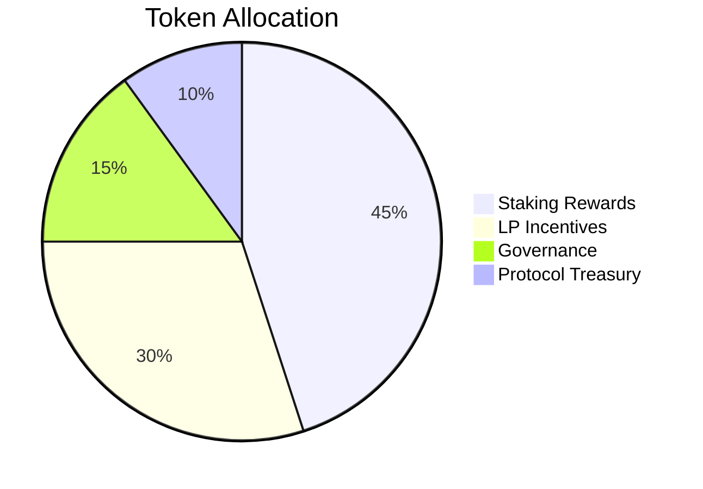

# Decentralized Perpetual Exchanges and Tokenomics: A Strategic Overview

## Why Tokenomics Matters in DeFi Protocols

Tokenomics serves as the backbone of protocol growth and stability in decentralized finance. The "DeFi Summer" era demonstrated both the potential and pitfalls of liquidity mining mechanisms. While early protocols like Sushiswap successfully attracted TVL through yield farming, unsustainable emission models often led to short-term "farm and dump" cycles. This contrasts sharply with sustainable approaches adopted by market leaders like Aave and Uniswap, where product-driven growth combined with thoughtful tokenomics created lasting value.

Key dynamics shaping token value include:
- **Protocol Alignment**: Token prices often precede market awareness in crypto projects
- **Sustainability Factors**: Emission models balancing user incentives and long-term viability
- **Value Accumulation**: Mechanisms converting protocol activity into tokenholder benefits

## Competitive Landscape of Decentralized Perpetual Exchanges

The perpetual exchange space has evolved through three major phases:

| Protocol | Launch Date | Key Innovation | Current Status |
|---------|------------|----------------|----------------|
| dYdX | 2020 | On-chain perpetual contracts | Transitioning to Cosmos-based chain |
| GMX | 2021 | P2P model with revenue sharing | Market leader in revenue generation |
| Synthetix | 2018 | Synthetic asset framework | Base layer for multiple derivatives platforms |

**Notable Developments**:
- dYdX v4 introduces 100% fee redistribution to stakers
- GMX's GLP pool achieves $1.2B TVL through optimized revenue splits
- Synthetix's sUSD maintains dominance as cross-platform collateral

👉 [Explore DeFi trading platforms](https://bit.ly/okx-bonus)

## Tokenomic Design Framework

### 1. Incentive Mechanisms

#### Staking Dynamics
Effective staking models reduce sell pressure while creating value accrual paths:

- **Fee-Only Distribution** (e.g., dYdX v4)
- **Hybrid Model** (GMX: 63% GLP, 27% GMX)
- **Security-Centric** (dYdX Chain: 90% fee allocation to validators)

**Optimal Staking Benefits**:
- 35-70% reduction in circulating supply
- 20-40% yield premium for stablecoin denominated rewards
- Enhanced protocol security through validator alignment

#### Liquidity Provider Optimization
The peer-to-pool model requires careful risk/reward calibration:

| Metric | GMX (GLP) | Gains (gDAI) |
|-------|----------|-------------|
| Avg. APR | 22% | 15% |
| Risk Exposure | High | Moderate |
| TVL | $1.2B | $180M |
| Fee Capture | 70% | 50% |

**Key Insights**:
- 70% GLP allocation drives liquidity dominance
- Gains' risk-mitigation model attracts conservative LPs
- Protocol treasury reserves act as loss buffers

#### Trading Incentives
Balancing growth and sustainability requires nuanced reward structures:

- **dYdX v3**: 25% supply allocated to trading rewards (inflationary)
- **Kwenta**: 5% supply cap with 12-month vesting (user quality focus)
- **GMX**: Volume-based emissions with dynamic adjustments

**Effective Parameters**:
- Reward caps at 15-20% of monthly volume
- 6-12 month vesting periods
- Multiplier for high-value traders

### 2. Value Capture Mechanisms

#### Buyback & Burn Strategies
Synthetix's recent implementation of deflationary mechanics demonstrates the power of supply control:

- 15% of protocol revenue allocated to SNX buybacks
- 81.35% staking ratio maintains fee capture
- Andromeda upgrade reduces inflation from 8% to 2%

**Case Study: Gains Network**
- $606K GNS burned since inception
- Supply maintained between 30-33M tokens
- 1.78% circulating supply reduction

#### Governance-Driven Value Flow
Effective governance structures enable protocol adaptation:

| Protocol | Governance Focus | Recent Outcome |
|---------|------------------|----------------|
| GMX | Market expansion | BNB market launch |
| dYdX | Protocol sustainability | Fee redistribution model |
| Synthetix | Risk parameters | Volatility circuit breakers |

👉 [Discover governance tools](https://bit.ly/okx-bonus)

### 3. Token Distribution Models

| Protocol | Team Allocation | Investor % | Community | Vesting Period |
|---------|-----------------|------------|-----------|----------------|
| dYdX | 15% | 27.7% | 50% | 24 months |
| GMX | 10% | 0% | 90% | 36 months |
| Synthetix | 20% | 50% | 30% | 12 months |

**Best Practices**:
- Community allocations >50% ensure decentralization
- Team tokens with 3+ year vesting periods
- Investor stakes with 24+ month cliff periods

### 4. Emerging Innovations

New mechanisms addressing key challenges:
- **Dynamic Emissions**: GMX v2 adjusts GLP rewards based on utilization
- **Cross-Protocol Staking**: Synthetix's sUSD collateral across 7 platforms
- **NFT Integration**: dYdX exploring tiered rewards for unique NFT holders

## Strategic Implementation Guide

### Sustainable Emission Framework
For a hypothetical $500M TVL protocol:

### Risk Mitigation Strategies
1. **Market Risk**: Dynamic fee splits adjusting to volatility
2. **Liquidity Risk**: Reserve buffers covering 5-10% of TVL
3. **Execution Risk**: Decentralized oracle networks for accurate pricing

## Future Outlook

Key trends shaping the next phase:
- **Chain Abstraction**: Multi-chain liquidity pools
- **AI Integration**: Algorithmic market making optimization
- **Regulatory Compliance**: On-chain KYC solutions

## FAQs

**Q: How do decentralized exchanges maintain liquidity?**
A: Through innovative models like peer-to-pool structures (GMX) and synthetic frameworks (Synthetix), which create self-sustaining liquidity ecosystems.

**Q: What makes a tokenomics model sustainable?**
A: Successful models balance emission rates with utility creation, ensuring token value grows with protocol adoption while minimizing sell pressure.

**Q: How do governance tokens create value?**
A: Through mechanisms like fee capture, voting rights, and protocol-controlled value accrual, which align with long-term stakeholder interests.

**Q: What's the future of decentralized trading platforms?**
A: The integration of AI-driven market making, cross-chain liquidity pools, and regulatory-compliant onboarding will drive mass adoption.

**Q: How do protocols prevent manipulation?**
A: Through dynamic parameter adjustments, decentralized oracle networks, and community governance mechanisms that adapt to emerging risks.

👉 [Start trading on OKX](https://bit.ly/okx-bonus)